<p align="center">
  
</p>

# AuditOS

**An AI-native operating system for assurance engagements.**

AuditOS treats an audit as one continuously evolving system of understanding — the **Shared Audit State** — instead of a pile of independent documents, spreadsheets, and evidence folders that all have to be kept consistent by hand. Every workspace, report, and (eventually) AI recommendation is a view generated from that one shared state, not an independent copy of it.

This repository is **Release 1**: a complete, static, offline-first prototype of the platform's operational core — navigation, data model, workspaces, synchronization, and governance mechanics — built to prove the architecture before any AI agent goes live in Release 2.

[](RELEASE_NOTES.md)
[](#release-1-capabilities)
[](#getting-started)
[](#getting-started)
[](#developer-guide)
[](#repository-structure)
[](#license)

[What is AuditOS](#what-is-auditos) ·
[Why AuditOS](#why-auditos--problems-it-solves) ·
[Architecture](#product-architecture) ·
[Lifecycle](#audit-lifecycle) ·
[Workspaces](#release-1-capabilities) ·
[Navigation & Data Model](#navigation--data-model) ·
[Release 1 vs Release 2](#release-1-vs-release-2--the-seam-inventory) ·
[Release 2 AI Vision](#release-2-ai-vision) ·
[Getting Started](#getting-started) ·
[Repository Structure](#repository-structure) ·
[Developer Guide](#developer-guide) ·
[Architecture Graph](#architecture-graph) ·
[Known Limitations](#known-limitations) ·
[FAQ](#faq) ·
[Roadmap](#roadmap) ·
[Contributing](#contributing) ·
[License](#license) ·
[Credits](#credits)

---

## What is AuditOS

AuditOS reimagines an assurance engagement as a continuously evolving operational system rather than a set of isolated activities. At its center is the **Shared Audit State**: the complete current understanding of an engagement — accumulated across planning, walkthroughs, evidence collection, testing, documentation, reporting, review, and approval. It is deliberately **not** a document, a database table, or a report. It is the authoritative representation of the engagement, and every workspace, every report, and every AI recommendation is derived from it.

In this model, AI observes, reasons, and proposes; a human reviews, modifies where necessary, and approves or rejects. Only after approval does the Shared Audit State evolve. Professional judgment, skepticism, materiality, and audit conclusions stay permanently human — AI performs operational work and prepares recommendations, humans perform assurance work and authorize decisions.

The first implementation targets **SOC 2 engagements** specifically, so the architecture can mature on a bounded problem before other assurance frameworks are added by extension rather than redesign.

> *"AuditOS is an AI-native operating system for assurance engagements that unifies people, knowledge, workflows, and artificial intelligence around a continuously evolving Shared Audit State, ensuring that every recommendation remains explainable, every decision remains accountable, every artifact remains synchronized, and every engagement remains under explicit human governance."*

## Why AuditOS — Problems It Solves

Modern assurance engagements generate an enormous volume of information — requirements from planning, controls from walkthroughs, evidence from multiple channels, documentation that's continuously revised, reports that change as understanding matures. Despite all of it describing the *same* engagement, these artifacts are typically maintained independently, so information drifts, knowledge gets duplicated, and context ends up living in individual auditors instead of in the engagement itself.

Every persona on an engagement experiences this differently:

| Persona | What fragmentation costs them today |
|---|---|
| **Engagement Lead** | Manually reading through documents to know if the engagement is on schedule, instead of having state surfaced automatically |
| **Auditor** | Time spent figuring out what to work on next and what changed since yesterday, instead of professional judgment |
| **Reviewer** | Reconstructing "what changed, why, who proposed it, what evidence supports it" by hand for every approval |
| **Subject Matter Expert** | Navigating an entire engagement to find the narrow slice of controls and evidence relevant to their review |
| **Client Representative** | Back-and-forth overhead from ambiguous evidence requests that lack context |

AuditOS is designed to eliminate rewriting the same documentation in multiple places, repeating evidence requests already answered elsewhere, and manually synchronizing documentation with current understanding — architecturally, not through someone remembering to update every copy.

**This isn't aspirational.** `prototype/js/services/evidence-lifecycle.js` defines one canonical, seventeen-status evidence vocabulary that every surface in Release 1 — the Evidence table, the Controls workspace, the generated testing workpaper — renders from. Two differently-sourced legacy vocabularies are mapped onto it rather than left to diverge, and a status the model doesn't recognize renders neutrally rather than being fabricated or dropped:

```mermaid
graph LR
    subgraph Request
        R1[Requested]
        R2[Requested by Consulting]
    end
    subgraph Collection
        C1[Population Pending]
        C2[Population Received]
        C3[Partially Received]
        C4[Received]
    end
    subgraph Review
        V1[Under Review]
        V2[Clarification Needed]
        V3[Revision Requested]
    end
    subgraph Resolution
        S1[Accepted]
        S2[Rejected]
        S3[Not Applicable]
        S4[Duplicate]
        S5[Reused]
        S6[Cross Engagement]
    end
    subgraph Closure
        L1[Archived]
        L2[Closed]
    end
    Request --> Collection --> Review --> Resolution --> Closure
```


What AuditOS explicitly does **not** attempt: autonomous auditing, replacing professional auditors, becoming a general-purpose AI chat product, or letting AI bypass organizational governance under any circumstance. It measures success by how much it increases auditor capability, never by how much auditor involvement it removes.

## Product Architecture

AuditOS is organized around seven conceptual layers, with dependencies flowing strictly inward — presentation depends on business logic, never the reverse. Release 1's actual `prototype/` folder structure maps onto this model directly:

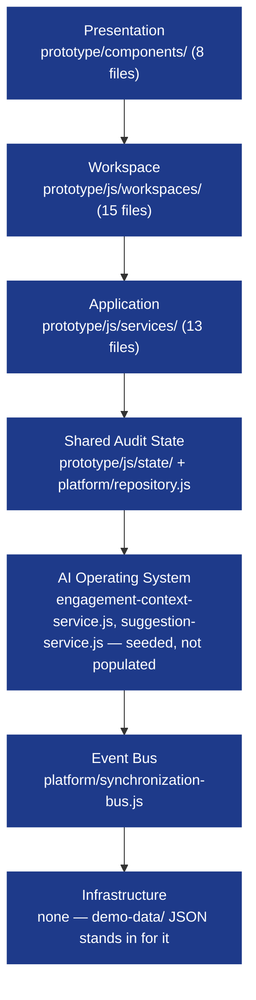

`prototype/js/platform/` (10 files) holds the mechanical substrate: the Repository (single data-access layer, twenty-three entity types), the Synchronization Bus (event propagation), the Suggestion Service (AI proposal lifecycle), the Audit Service (immutable event log), Permissions (capability descriptor, not an authorization engine), and four supporting engines (id minting, cross-workspace relationships, dependency traversal, industry knowledge). Every one of these is real, working code today — what's absent is the intelligence that would eventually call into them. See [Release 1 vs. Release 2](#release-1-vs-release-2--the-seam-inventory) for exactly which seams are populated and which aren't.


## Audit Lifecycle

Conceptually, every engagement progresses through fourteen cumulative stages — nothing is discarded or recreated, understanding simply matures:

```mermaid
graph LR
    S1[1 Engagement<br/>Creation] --> S2[2 Planning<br/>and Scoping]
    S2 --> S3[3 Environment<br/>Understanding]
    S3 --> S4[4 Control<br/>Identification]
    S4 --> S5[5 Walk-<br/>throughs]
    S5 --> S6[6 Evidence<br/>Requests]
    S6 --> S7[7 Evidence<br/>Collection]
    S7 --> S8[8 Control<br/>Testing]
    S8 --> S9[9 Observ-<br/>ations]
    S9 --> S10[10 Findings]
    S10 --> S11[11 Reporting]
    S11 --> S12[12 Review and<br/>Approval]
    S12 --> S13[13 Engagement<br/>Completion]
    S13 --> S14[14 Organizational<br/>Learning]
```

Day to day, within one active engagement, the concrete work an audit team executes is a **six-stage operational pipeline** — this is what the Engagement workspace actually renders, not an aspiration:

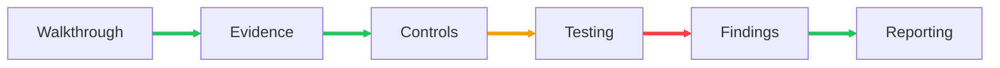

*(Green = flowing, amber = waiting, red = blocked — an illustrative connector state, not one specific engagement's live data.)* Every connector in the real workspace carries the health of the stage it leaves, so the pipeline reads as one connected operational flow rather than a row of disconnected cards.


Documentation is deliberately *not* its own stage — it's a continuous projection of the Shared Audit State living inside the Reporting workspace's Section III, generated from approved walkthroughs, evidence, controls, testing, and findings. Documents are outputs of the state, never a separate source of it.

## Release 1 Capabilities

Release 1 is a faithful, read-mostly visualization layer over a real demo dataset. Three surfaces perform genuine, audited writes (Walkthrough, both creation wizards, Global Approvals); everything else renders exactly what the current JSON says and invents nothing.

### Home
The single entry point — deliberately narrow. Home answers exactly one question, "which client do I work with now?" It never shows engagement summaries or activity feeds; its only action is selecting a client. Users never auto-resume a previous session — that's always an explicit choice.


### Client
One level down from Home: a module-driven operational portfolio — engagement health, portfolio progress, team/POC workload, AI advisory signals, and cross-entity search. Completed engagements stay visible but read-only, excluded from active-work aggregates.


### Audit Program
Groups several concurrent engagements that share requirements, controls, and evidence — answering "where is evidence being reused across engagements instead of re-collected?" Read-only in Release 1: no AI, no workflow engine, no writes.


### Engagement
The operational entry point into one audit, organized around the six-stage pipeline above with per-connector health, next actions, and blocking items.

### Walkthrough
The one workspace that is **not** read-only. Implements the Team → POC operating hierarchy directly: a roster of teams and their readiness, each team's command center (scheduling, ingestion, dependencies, AI Suggestions, Industry Knowledge), and each POC's detail below that. Scheduling, ingestion, comments, and the Suggestion lifecycle are all real, audited Repository writes — AI still never writes directly, but humans acting in this workspace genuinely do.


### Evidence
"The operational object of an engagement," in its own header's words — a deliberately consolidated surface (filters, metrics, table, drawer, workflow) rendering the canonical status vocabulary described above.

### Controls
A faithful visualization of the evolving control library — no AI, no writes, no workflow engine in Release 1. Release 2's named extension: AI agents drafting, refining, deduplicating, and proposing controls.

### Testing
Where "audit knowledge becomes audit assurance" — validating controls using evidence. Architecturally identical to the other workspaces: Business → ViewModel → Components → DOM, one read of state, nothing inferred.


### Findings
Rebuilt as a true Observation Register with a governed seven-state lifecycle: **Detected → AI Drafted → Under Review → Management Response → Accepted → Resolved → Closed**. "AI Drafted" is a real, selectable state with zero populated records today — a named seam, not a missing feature.


### Reporting
The living report — read, traced to sources, edited through approval, versioned, and exported from engagement creation onward, not assembled at the end. Five canonical sections (Management Assertion, Independent Auditor Report, System Description, Testing Results, Entity Information), three of which regenerate continuously from recorded facts.


### AI Usage
Administrator-only telemetry and spend-accounting surface, built on the **complete Release 2 telemetry schema** ahead of any agent that would populate it live. Every number — tokens, cost, provider, model, cache, latency, confidence, billing — renders from real demo data through the Repository, nothing hardcoded.


### Audit Log
The platform-wide surface of the immutable audit trail — honestly empty at baseline (the dataset fabricates no history) and filling as simulated actions are performed in the current session.

### Global Approvals
The one actionable approval inbox, inbox-style (Outlook / pull-request pattern): a searchable rail of everything awaiting a decision plus an inspector where the decision happens. Three live approval types route through it today; the rest stay honestly reserved.


### Client & Engagement Creation Wizards
Two real, capability-gated, multi-step creation flows — not placeholders. The Client Wizard captures eight steps; the Engagement Wizard captures seven. Every selectable option derives from real records (engagement types are read from the dataset's own distinct values, never a fabricated list), and each ends in a Review step that reads back everything captured before a single Repository write happens.


## Navigation & Data Model

All work is organized around one permanent hierarchy — nothing re-derives a client, engagement, or workspace list locally:

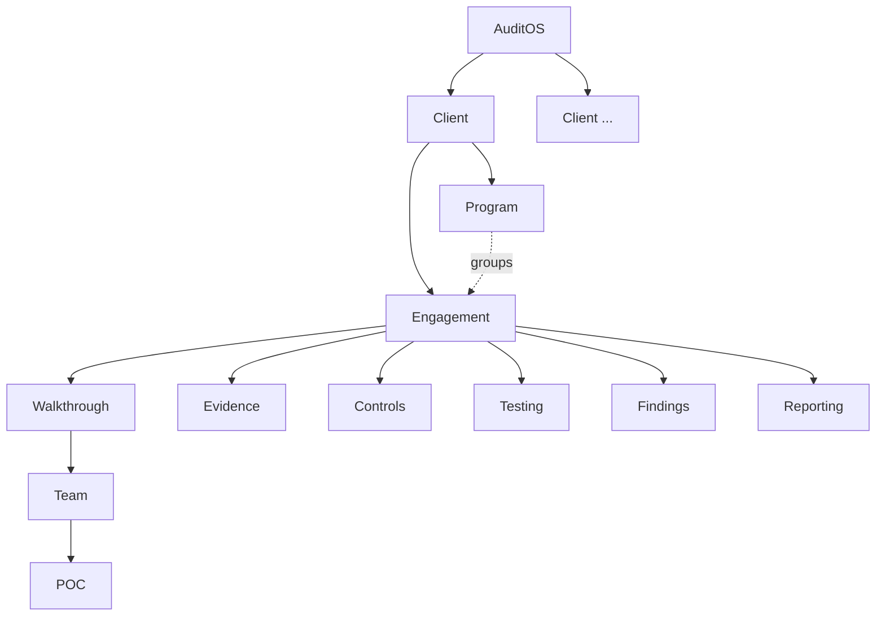

Every route's scope is explicit in the URL itself — platform-scoped workspaces are flat (`#/home`, `#/program`), client-scoped routes name the client, and engagement-scoped workspaces always carry the full path:

```text
#/home
#/{platformWorkspacePath}[/{recordId}]
#/client/{clientId}
#/client/{clientId}/engagement/{engagementId}
#/client/{clientId}/engagement/{engagementId}/{workspacePath}[/{recordId}[/{pocId}]]
```

Identifiers are always the entities' own record ids (`CMP-MER`, `ENG-MER-ZPQP-2025`) — never derived slugs. A single deep link like `#/client/CMP-MER/engagement/ENG-MER-ZPQP-2025/walkthrough/TEAM-MER-005/POC-MER-024` addresses one POC, inside one team, inside one engagement, inside one client — every level of the hierarchy present at once.

Underneath navigation sits a domain of eighteen Core Concepts, all of it converging on one Shared Audit State:

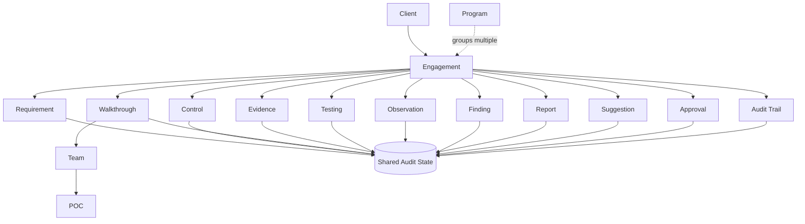

Two other synchronization chains keep those concepts consistent without any page ever talking to another page directly — a downstream chain fired by walkthrough-originated changes, and a second, independent upstream chain fired by approved report edits:

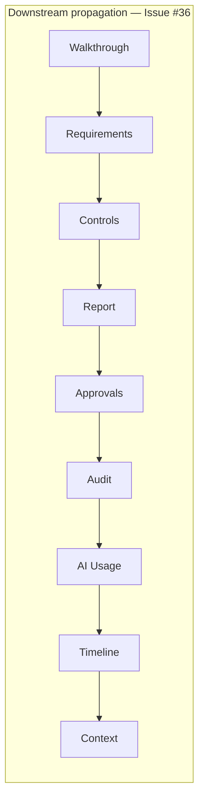

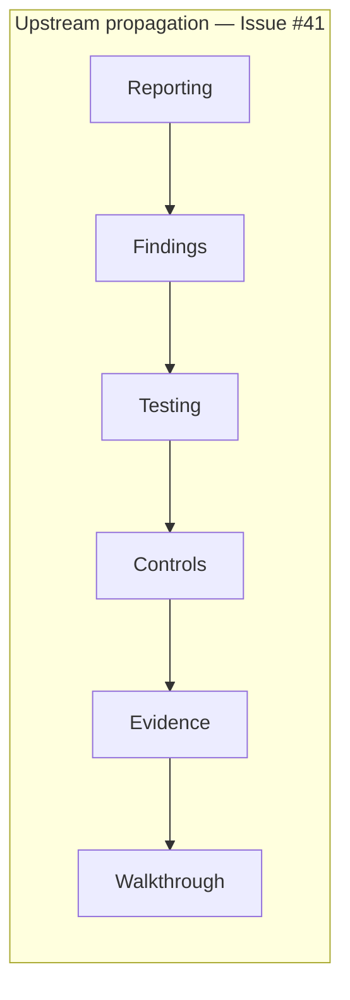

Both chains publish one event per hop, recorded under one correlation id in the Audit Log, so either direction of propagation is inspectable end to end. Both are, today, **scripted simulations** of what Release 2 replaces with real event producers behind the same `publish`/`subscribe` contract.


## Release 1 vs. Release 2 — The Seam Inventory

This is the most direct answer to "how much of the AI vision is actually built?" Every Release 2 architectural component already has a named Release 1 seam — most are honest about exactly how far they get:

| Release 2 component | Release 1 seam | Status |
|---|---|---|
| Shared Audit State (the brain) | `state-store.js`, `repository.js` | **Implemented** — mechanical substrate only, no approval gate |
| Event Bus (the nervous system) | `synchronization-bus.js`, `report-propagation-service.js` | **Implemented** as scripted simulation |
| Context | `engagement-context-service.js` | **Implemented** as a stored record, not an assembly engine |
| Recommendation Engine | `suggestion-service.js` | **Implemented** — 6 of 10 documented states, `confidence` field always null, categories don't yet match vision |
| Human Approval Engine (the conscience) | none | **Not implemented** |
| Memory & Knowledge Architecture | `industry-knowledge.js` (1 of 5 layers) | **Partially implemented** |
| Orchestration Architecture (the scheduler) | none (`dependency-service.js` models data/sequence only) | **Not implemented** — the widest gap found |
| Explainability Engine | `ai-lineage-service.js` | **Implemented** — populated by the Narrative Agent on approval; zero records in the seeded dataset |
| AI Agents (all seven) | `narrative-agent.js`, `impact-agent.js` (2 of 7) | **Partially implemented** — the Documentation agent drafts Section III and the Reporting agent reasons about edit impact; the other five are named and specified below |

Eight of these nine rows are unchanged: Release 1 remains thorough about the *mechanics* of governance — writes are audited, propagation is deterministic, lifecycles are enforced — and honest about the absence of intelligence behind them. The ninth is where that changed. The Narrative Agent is a real model call, and it landed without altering a single one of the mechanics rows: it drafts, it proposes, and a human decides. The Human Approval Engine is still marked *not implemented* because no general engine exists — what exists is the Suggestion lifecycle carrying one agent's output, which is the substrate such an engine would be built on rather than the engine itself.

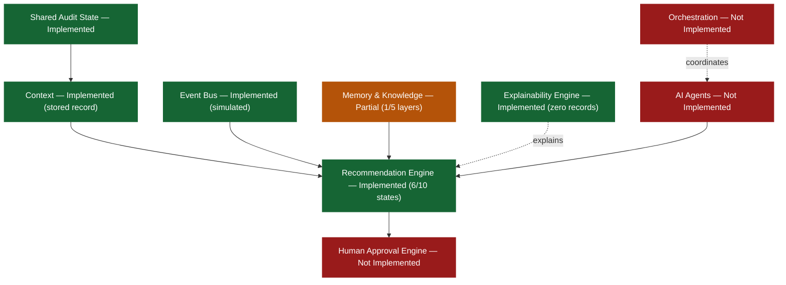

## Release 2 AI Vision

Seven named AI agents make Release 2 more than infrastructure — each stateless, event-driven, and permanently gated behind human approval. The first, Documentation, is implemented: `narrative-agent.js` drafts Section III's prose and files it as a Suggestion for human decision. The remaining six follow the same shape with different inputs and a different apply target; roughly half already have a precise landing point in Release 1 code, and half would require first choosing where in the existing workspace an AI-authored recommendation attaches:

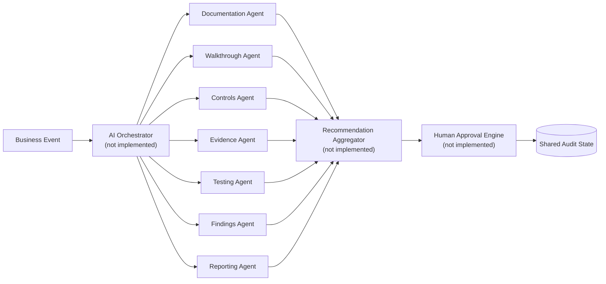

| Agent | Synchronization Bus event | Plug-in point | Specificity |
|---|---|---|---|
| Documentation | `CONTEXT_UPDATED` / `REPORT_UPDATED` | `narrative-agent.js` → Suggestion → `reportGenerationService.draftNarrative` | **Implemented** — drafts Section III, publishes on approval |
| Walkthrough | `WALKTHROUGH_UPDATED` | `dependency-service.js`'s live-derivation comment | Comment only, no reserved function |
| Controls | `CONTROLS_UPDATED` | `controls.js`'s Appendix A comment | Comment only, no reserved function |
| Evidence | `EVIDENCE_UPDATED` | `ai-lineage-service.js`'s `aiLineage`/`origin` block | Named data contract, zero populated records |
| Testing | `TESTING_UPDATED` | `testing.js`'s Appendix A comment | Comment only, no reserved function |
| Findings | `FINDINGS_UPDATED` | `findings.js`'s `"AI Drafted"` lifecycle state | Named state, zero populated records |
| Reporting | `REPORT_UPDATED` | `impact-agent.js` → `reportPropagationService.describeImpact` | **Implemented** — reasons about what an edit implies for each upstream object |

Every agent shares the same governance mechanics regardless of domain: output enters the existing `Suggested → Reviewed → Approved → Applied` lifecycle, every approved write records one immutable audit event, and failures — insufficient context, provider failure, timeout — would never modify the Shared Audit State and would always be observable.

The report itself is generated, not authored — three of its five canonical sections regenerate continuously from recorded facts, with two distinct AI extension points marked directly in code:

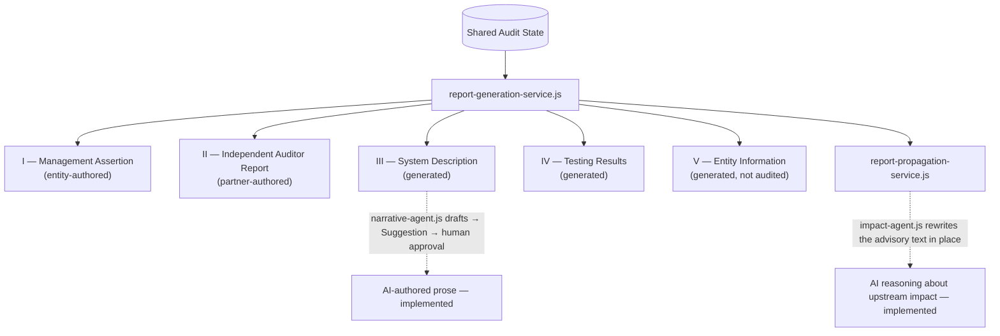


Every non-goal from Release 1 carries forward unchanged: no autonomous auditing, no replacing professional auditors, no AI bypassing governance under any circumstance. Adding real agents changes *what proposes* changes to the Shared Audit State — never *who approves them*.

## Getting Started

Release 1 requires **nothing** to run:

```text
1. Clone or download this repository
2. Open prototype/index.html directly in a browser
3. That's it
```

No `npm install`, no build step, no dev server, no internet connection. `prototype/vendor/` contains exactly two vendored libraries (Bootstrap and Bootstrap Icons), loaded locally — every script is a classic `<script src="...">` tag, deliberately never an ES Module, specifically so the application works correctly opened straight from `file://`.

### Optional — enabling AI narrative drafting

The application above is complete without this. Running the AI backend adds one thing: the Narrative Agent drafts Section III's prose for human approval.

```text
1. pip install -r backend/requirements.txt
2. cp backend/.env.example backend/.env   # then add your Gemini API key
3. uvicorn main:app --host 127.0.0.1 --port 8787 --app-dir backend --reload --reload-dir backend
4. Open prototype/index.html and visit an engagement's Reporting workspace
```

`--reload` restarts the service when its Python changes. Configuration in
`backend/.env` needs no restart at all — the service re-reads it on every
request, so adding, removing, or rotating the key takes effect immediately.
Confirm which key the service is actually using with `curl -s
localhost:8787/api/health`: `"configured": true` means a key is loaded in the
running process, which is the only thing that determines whether AI is on.

The backend binds to loopback and holds two things the browser must never see: the model credential, and the prompt whose grounding constraint keeps a draft honest. Stop it and the application returns to the behaviour above — every AI call resolves to nothing, and the report renders exactly as it does with no AI at all.

Backend tests run on the Python standard library alone: `python3 -m unittest discover -s backend`.

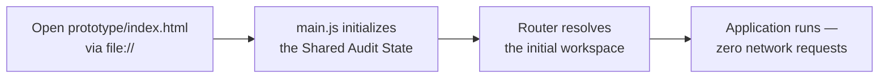

## Repository Structure

```text
AuditOS/
├── AUDITOS.md                 # Canonical engineering documentation (18 chapters, 7 appendices)
├── AuditOS-Knowledge-Base.md  # Archival source every "Document N" citation in AUDITOS.md points into
├── README.md                  # This file — product presentation, not engineering reference
├── docs/
│   └── architecture/          # 3 files — a second live source alongside the Knowledge Base
├── images/                    # 43 screenshots captured directly from the running prototype
├── graphify-out/              # Generated knowledge graph (gitignored, regenerate with `graphify update .`)
└── prototype/                 # The entire working application
    ├── index.html             # Single entry point — open this directly
    ├── js/
    │   ├── main.js             # Two-step bootstrap: Shared Audit State, then routing
    │   ├── platform/           # 10 files — Repository, Synchronization Bus, Suggestions, Audit, Permissions...
    │   ├── services/           # 13 files — navigation, context resolution, report generation, exports...
    │   ├── state/               # 2 files — the Shared Audit State store and demo-data registry
    │   ├── router/               # 2 files — router and workspace registry
    │   └── workspaces/           # 15 files — one per workspace (Chapter 15) plus Program and both wizards
    ├── components/              # 8 files — the Presentation layer (component library, workspace framework...)
    ├── css/                      # 25 stylesheets
    ├── demo-data/                 # 109 JSON files across 15 domains — the entire simulated dataset
    ├── vendor/                     # Bootstrap and Bootstrap Icons — the only two vendored libraries
    ├── tools/                       # validate.js — developer-only headless-browser validation
    └── tests/                        # 919 offline, dependency-free tests (smoke, unit, integration)
```

## Developer Guide

`AUDITOS.md` is the canonical engineering reference — eighteen chapters and seven appendices covering every platform concept down to the specific file, function, and line that implements it, plus a complete Release 2 gap analysis (Appendix C), a per-file repository inventory (Appendix A), and known limitations (Appendix G). This README summarizes and links to it; it never duplicates it.

Two Node-based developer tools exist and are **not** part of what ships — an end user never runs either:

```bash
# Offline, dependency-free test suite (no browser, no framework)
node prototype/tests/run-tests.js
# → 919/919 passing

# Headless-browser validation of the live DOM and console (requires Playwright locally)
node prototype/tools/validate.js
# → 0 console errors, 0 failed assets
```

Every workspace follows the same architectural pattern, stated close to verbatim in each file's own header comment: **Business → ViewModel → Components → DOM**. `collectViewModel` is the single place a workspace reads state, returning a pure, offline-testable derivation; the renderer then fills the Shared Workspace Framework's slots from the Enterprise Data Presentation System — never bespoke primitives. A new workspace is expected to follow this same shape.

## Architecture Graph

This repository maintains a [Graphify](https://github.com/emeraldarrow/Graphify) AST-derived knowledge graph at `graphify-out/` (gitignored, regenerated with `graphify update .`). The current graph covers 11,269 nodes and 14,923 edges across 387 communities. Excluding the two vendored Bootstrap libraries, the largest application-code communities are the workspace and service layers this README already describes in detail:

| Community | Real functions (sample) |
|---|---|
| `controls.js` | `buildControlCanvas()`, `buildControlInspector()`, `buildControlRail()`, `buildEvidenceRow()` |
| `findings.js` | `buildFindingInspector()`, `buildObservationCanvas()`, `buildHistoryBody()`, `buildLineageBody()` |
| `workspace-framework.js` | `applyHeader()`, `buildActionArea()`, `buildBadge()`, `buildButton()` |
| `walkthrough.js` | `buildActivityBody()`, `buildAuditHealth()`, `buildPocCardsBody()`, `buildQuestionsBody()` |

For the full graph — every community, every god node, every cross-file relationship — see `graphify-out/GRAPH_REPORT.md` after running `graphify update .` locally; it is intentionally not embedded wholesale here.

## Known Limitations

Verified constraints of Release 1 as it exists today, independent of any Release 2 vision:

- **All data is in-memory only.** A page reload or the Reset control discards every write back to the seeded demo dataset. Nothing is written to disk, a database, or a server — `repository.js`'s simulated `SIM-`-prefixed writes are the entire persistence model, because a portable `file://` `index.html` cannot reliably write files.
- **There is no authentication and no real access control.** A session's identity and capabilities are fixed at load time; `permissions.js` documents itself as gating *visibility*, not authorization.
- **There is no application backend and no multi-user collaboration.** Release 1 runs entirely in one browser tab; two people opening it — or the same person in two tabs — never see each other's writes. The one server-side component, `backend/`, exists solely to hold the model credential for AI drafting; it stores nothing and knows nothing about engagements.
- **One AI agent executes, and only when you run the backend.** The Narrative Agent drafts Section III's prose from the recorded facts that section is generated from. Every other AI-labeled surface still operates on authored, static demo data or renders an honest empty state. With `backend/` stopped — the default — no model is called anywhere and the application behaves exactly as it did before AI existed.
- **The Repository Foundation does not yet cover every business-data read.** Nine workspace files plus the header component read some collections directly rather than through a repository. Every collection now has a repository entry — `findings`, `testing`, and `samples` were the last three without one — but a collection having a repository does not mean every reader uses it.
- **Architectural boundaries are enforced by convention, not tooling.** Release 1 has no build step, linter, or type system — boundaries hold only as far as consistent authorship keeps them.
- **Three registered workspace identities have no workspace behind them.** `GOVERNANCE`, `AI`, and `EXECUTIVE` are declared in the router's registry but unreachable from any menu, breadcrumb, or link.
- **Whether Suggestion decisions belong in Global Approvals is unverified.** Global Approvals routes three types today; Suggestions are decided in each owning workspace's own panel instead, and this repository has not confirmed whether that split is intentional and permanent.
- **The demo dataset is fixed and scripted.** Every record a reader sees belongs to one of two seeded clients/engagements; records created through a wizard are real writes but share the same in-memory, discarded-on-reset lifetime as every other write.

The full comparative analysis behind each of these — implemented behavior, documented vision, and impact — lives in `AUDITOS.md`, Appendices C and G.

## FAQ

**Is this a real product or a mockup?**
Neither, exactly. It's a fully functional, offline-capable prototype of the operational platform — real navigation, a real data model, real audited writes for three workflows (Walkthrough, both wizards, Global Approvals), and 919 passing tests. What it is *not* is a live, multi-user, persistent, AI-powered system — that's Release 2.

**Does the AI actually work today?**
Two agents do. Run `backend/` with a Gemini key and the Narrative Agent drafts Section III's prose from that section's recorded facts, files it as a Suggestion, and publishes it only once a human approves — with AI lineage recorded against the section at that point. The Impact Agent reasons about what a proposed report edit means for each upstream object it draws on; it proposes no change of its own, only sharpening the advisory text on the edit a human is already deciding. Every other AI-shaped surface — the remaining five agents, the Suggestion confidence field — remains a reserved extension point with an honest empty state. See [Release 1 vs. Release 2](#release-1-vs-release-2--the-seam-inventory).

**Can the AI put something wrong in a report?**
Not without a person approving it, and not silently. A draft is grounded in the section's recorded facts by construction: the backend rejects any draft stating a figure those facts do not contain, so a fabricated number is refused rather than returned. What survives that check is still only a proposal — it appears in the Reporting inspector awaiting a decision, and reaches neither the report nor any export until it is approved and applied.

**Why is the backend so small?**
It holds the model credential and the prompt, and nothing else. Anything in `prototype/` is readable by every user, so a key there is a published key and a prompt there is one any user can rewrite — including the constraint that keeps a draft grounded. Everything else about Release 1 stays as it was: navigation, hierarchy, synchronization, governance mechanics, and data shape are all still proven in a static prototype that runs from `file://` with zero installation.

**Why SOC 2 first?**
So the architecture, UX, and AI orchestration model can mature on one bounded, well-understood assurance framework before other frameworks (ISO 27001, PCI DSS, HIPAA, internal audit) are added as extensions rather than requiring a redesign.

**What happens to my data if I reload the page?**
It resets. Every write in Release 1 — approvals, new records, advanced report versions, audit trail entries — lives in memory only and returns to the seeded demo baseline on reload, by design (see [Known Limitations](#known-limitations)).

**Can I use this commercially today?**
Not yet — no license has been finalized. See [License](#license) for the drafts under review.

## Roadmap

The product roadmap defines seven phases; this repository is Release 1, sitting between the roadmap's Phase 1 and Phase 2 in its own terms:

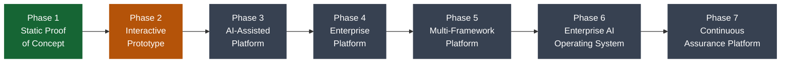

- **Phase 1 — Static Proof of Concept** *(this release)* — the operational platform and data model, no persistence, no live AI.
- **Phase 2 — Interactive Prototype** — simulated Business Events and Shared Audit State become real; AI remains simulated where appropriate.
- **Phase 3 — AI-Assisted Platform** — the seven named agents, Recommendation Aggregation, and the Human Approval Engine go live.
- **Phase 4 — Enterprise Platform** — enterprise identity, integrations, and production deployment architecture.
- **Phase 5 — Multi-Framework Platform** — ISO 27001, PCI DSS, HIPAA, internal audit, privacy, and risk management, without changing the Business Object Model.
- **Phase 6 — Enterprise AI Operating System** — coordinated multi-agent reasoning, cross-engagement learning, executive decision support.
- **Phase 7 — Continuous Assurance Platform** — continuous evidence ingestion and real-time assurance, "complementing rather than replacing professional judgment."

## Contributing

See [CONTRIBUTING.md](CONTRIBUTING.md) for the development workflow, testing expectations, and architectural conventions every change is expected to follow.

## License

No license has been finalized yet. Three drafts are under review — every one of them is explicitly marked **DRAFT — REQUIRES LEGAL REVIEW** and none is a final, legally binding license:

- **[LICENSE-COMMUNITY.md](LICENSE-COMMUNITY.md)** — a non-commercial / source-available community license draft
- **[LICENSE-COMMERCIAL.md](LICENSE-COMMERCIAL.md)** — draft terms for a paid commercial license
- **[MONETIZATION.md](MONETIZATION.md)** — comparison of licensing and monetization strategies, with a recommended model

Until one is formally adopted, treat this repository as **all rights reserved** for any use beyond personal evaluation.

## Credits

Bootstrap and Bootstrap Icons are the only two third-party dependencies anywhere in Release 1 — both vendored locally, loaded from no CDN. Everything else in `prototype/` is original, vanilla HTML5, CSS3, and JavaScript.

Full engineering credit and the complete architectural record live in [AUDITOS.md](AUDITOS.md).

---

<sub>See also: [Release Notes v1.0.0](RELEASE_NOTES.md) · [Canonical engineering documentation](AUDITOS.md) · [Contributing](CONTRIBUTING.md)</sub>
